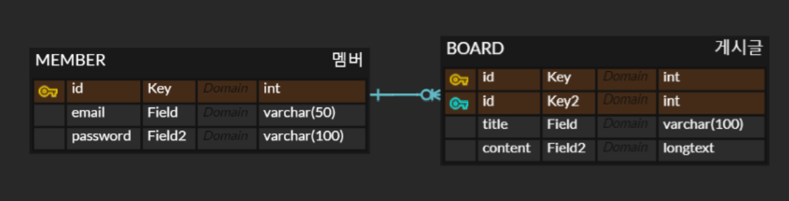

# wanted-pre-onboarding-backend

게시판을 관리하는 를 개발하고 그 결과를 제출해야 합니다. (3. API 요구사항 참고)

## 지원자의 성명

## 윤지영

- 사용한 기술 스택
  - Java/Spring Boot
- 데이터 저장소
  - MySQL 8.0

  

## 애플리케이션의 실행 방법 (엔드포인트 호출 방법 포함)

- 회원가입 엔드포인트
  - POST /member/user
- 로그인 엔드포인트
  - POST /member/login
- 로그아웃 엔드포인트
  - POST /member/logout
- 게시글 생성 엔드포인트
  - POST /notion
- 게시글 수정 엔드포인트
  - PUT /notion/{notion-id}
- 게시글 삭제 엔드포인트
  - DELETE /notion/{notion-id}
- 게시글 상세 조회 엔드포인트
  - GET /notion/{notion-id}
- 게시글 목록 조회 엔드포인트
  - GET /notion/list

---

### 데이터베이스 테이블 구조

  

---

### 구현한 API의 동작을 촬영한 데모 영상 링크

---

### 구현 방법 및 이유에 대한 간략한 설명

- 데이터 전송을 Json으로 설정
- JPA의 영속성 컨텍스트를 통해 DB관리
- RESTful API 규칙을 지켜서 생성

---

### API 명세(request/response 포함)

---

<!--   

## 3. API 요구 사항

<!--
게시판을 관리하는 RESTful API를 개발해 주세요. 이때, 다음의 기능을 구현해야 합니다. 데이터베이스의 테이블 설계는 지원자분의 판단에 맡겨져 있습니다. 요구사항을 충족시키는 데 필요하다고 생각되는 구조로 자유롭게 설계해 주세요.

- **과제 2. 사용자 로그인 엔드포인트**
  - 사용자가 올바른 이메일과 비밀번호를 제공하면, 사용자 인증을 거친 후에 JWT(JSON Web Token)를 생성하여 사용자에게 반환하도록 해주세요.
  - 과제 1과 마찬가지로 회원가입 엔드포인트에 이메일과 비밀번호의 유효성 검사기능을 구현해주세요.
- **과제 3. 새로운 게시글을 생성하는 엔드포인트**
- **과제 4. 게시글 목록을 조회하는 엔드포인트**
  - 반드시 Pagination 기능을 구현해 주세요.
- **과제 5. 특정 게시글을 조회하는 엔드포인트**
  - 게시글의 ID를 받아 해당 게시글을 조회하는 엔드포인트를 구현해 주세요.
- **과제 6. 특정 게시글을 수정하는 엔드포인트**
  - 게시글의 ID와 수정 내용을 받아 해당 게시글을 수정하는 엔드포인트를 구현해 주세요.
  - 게시글을 수정할 수 있는 사용자는 게시글 작성자만이어야 합니다.
- **과제 7. 특정 게시글을 삭제하는 엔드포인트**
  - 게시글의 ID를 받아 해당 게시글을 삭제하는 엔드포인트를 구현해 주세요.
  - 게시글을 삭제할 수 있는 사용자는 게시글 작성자만이어야 합니다. -->
